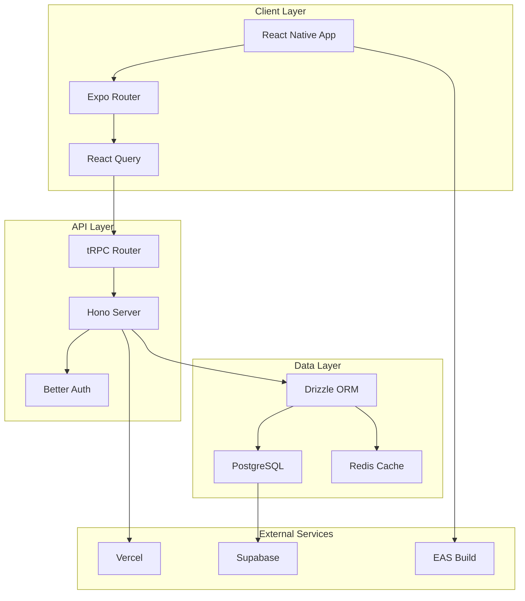
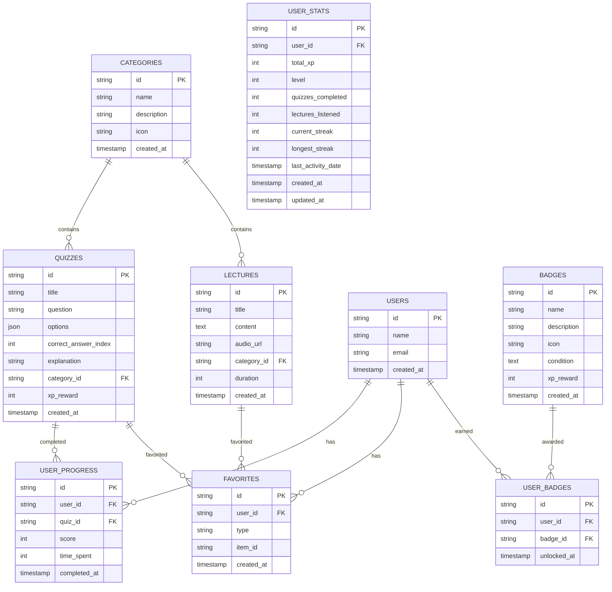
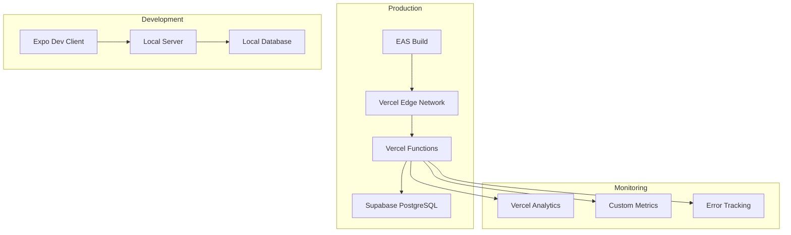

# 🏗️ Architecture - DeenQuest

Ce document décrit l'architecture technique de DeenQuest.

## 📋 Vue d'ensemble

DeenQuest est une application mobile native avec une architecture moderne basée sur :

- **Frontend** : React Native avec Expo
- **Backend** : API tRPC avec Hono
- **Base de données** : PostgreSQL avec Drizzle ORM
- **Authentification** : Better Auth
- **Déploiement** : Vercel (API) + EAS Build (Mobile)

## 🎯 Principes architecturaux

### 1. Type Safety
- TypeScript end-to-end
- tRPC pour l'API type-safe
- Drizzle ORM avec inférence de types

### 2. Monorepo
- Structure modulaire avec Turborepo
- Partage de code entre apps
- Build et déploiement optimisés

### 3. Performance
- Lazy loading des écrans
- Cache intelligent avec React Query
- Optimisations bundle avec Metro

### 4. Scalabilité
- Architecture modulaire
- Séparation des responsabilités
- Patterns réutilisables

## 🏢 Architecture globale



## 📱 Architecture Frontend

### Structure des dossiers

```
apps/native/
├── app/                    # Écrans avec Expo Router
│   ├── (tabs)/            # Navigation par onglets
│   │   ├── index.tsx      # Écran d'accueil
│   │   ├── quiz.tsx       # Liste des quiz
│   │   ├── lectures.tsx   # Liste des lectures
│   │   ├── favorites.tsx  # Favoris
│   │   └── profile.tsx    # Profil utilisateur
│   ├── auth/              # Authentification
│   ├── quiz/              # Détails des quiz
│   ├── category/          # Catégories
│   ├── lecture/           # Détails des lectures
│   └── _layout.tsx        # Layout racine
├── components/            # Composants réutilisables
│   ├── Badge.tsx         # Composant badge
│   ├── ThemedView.tsx    # Vue thématisée
│   └── ThemedText.tsx    # Texte thématisé
├             # Utilitaires et hooks
│   ├── trpc.ts          # Configuration tRPC
│   ├── auth-context.tsx # Contexte d'authentification
│   ├── theme-context.tsx # Contexte de thème
│   └── offline-storage.ts # Stockage offline
└── assets/              # Images et ressources
```

### Navigation

```typescript
// Expo Router - Navigation basée sur les fichiers
app/
├── (tabs)/
│   ├── _layout.tsx      # Layout des onglets
│   └── index.tsx        # /
├── quiz/
│   ├── _layout.tsx      # Layout des quiz
│   ├── [id].tsx         # /quiz/[id]
│   └── random.tsx       # /quiz/random
└── _layout.tsx          # Layout racine
```

### State Management

```typescript
// React Query + tRPC pour l'état serveur
const { data: quizzes } = trpc.quizzes.getAll.useQuery();

// Context API pour l'état global
const { user } = useAuth();
const { theme } = useTheme();

// Local state avec useState/useReducer
const [selectedAnswer, setSelectedAnswer] = useState(null);
```

### Composants

```typescript
// Composants atomiques
<ThemedView variant="card">
  <ThemedText size="lg" weight="bold">
    Titre
  </ThemedText>
  <Badge name="First Steps" unlocked={true} />
</ThemedView>

// Composants composés
<QuizCard
  quiz={quiz}
  onPress={() => router.push(`/quiz/${quiz.id}`)}
/>
```

## 🖥️ Architecture Backend

### Structure des dossiers

```
apps/server/
├── src/
│   ├── routers/           # Routers tRPC
│   │   ├── categories.ts  # CRUD catégories
│   │   ├── quizzes.ts     # CRUD quiz
│   │   ├── lectures.ts    # CRUD lectures
│   │   ├── favorites.ts   # Gestion favoris
│   │   ├── user.ts        # Profil utilisateur
│   │   ├── badges.ts      # Système de badges
│   │   └── index.ts       # Router principal
│   ├── db/               # Base de données
│   │   ├── schema/       # Schémas Drizzle
│   │   ├── seed.ts       # Données de test
│   │   └── index.ts      # Configuration DB
│   ├── lib/              # Utilitaires
│   │   ├── auth.ts       # Configuration Better Auth
│   │   ├── trpc.ts       # Configuration tRPC
│   │   ├── monitoring.ts # Monitoring
│   │   └── security.ts   # Sécurité
│   └── index.ts          # Point d'entrée
├── drizzle.config.ts     # Configuration Drizzle
└── package.json
```

### API Layer

```typescript
// tRPC Router
export const appRouter = router({
  categories: categoriesRouter,
  quizzes: quizzesRouter,
  lectures: lecturesRouter,
  favorites: favoritesRouter,
  user: userRouter,
  badges: badgesRouter,
});

// Procédures
export const categoriesRouter = router({
  getAll: publicProcedure.query(async () => {
    return await db.select().from(categories);
  }),

  getById: publicProcedure
    .input(z.object({ id: z.string() }))
    .query(async ({ input }) => {
      // Logique métier
    }),
});
```

### Data Layer

```typescript
// Schéma Drizzle
export const categories = pgTable('categories', {
  id: text('id').primaryKey(),
  name: text('name').notNull(),
  description: text('description'),
  icon: text('icon').notNull(),
  createdAt: timestamp('created_at').defaultNow(),
});

// Relations
export const quizzes = pgTable('quizzes', {
  id: text('id').primaryKey(),
  categoryId: text('category_id').references(() => categories.id),
  // ...autres champs
});
```

### Middleware

```typescript
// Sécurité
app.use(createSecurityMiddleware());
app.use(createRateLimitMiddleware());

// Monitoring
app.use(createMonitoringMiddleware());

// CORS
app.use(cors({
  origin: process.env.CORS_ORIGIN,
  credentials: true,
}));
```

## 🗄️ Architecture Base de données

### Schéma relationnel



### Indexation

```sql
-- Index pour les performances
CREATE INDEX idx_quizzes_category_id ON quizzes(category_id);
CREATE INDEX idx_lectures_category_id ON lectures(category_id);
CREATE INDEX idx_user_progress_user_id ON user_progress(user_id);
CREATE INDEX idx_favorites_user_id ON favorites(user_id);
CREATE INDEX idx_user_badges_user_id ON user_badges(user_id);
CREATE INDEX idx_user_stats_user_id ON user_stats(user_id);

-- Index composites
CREATE INDEX idx_favorites_user_type ON favorites(user_id, type);
CREATE INDEX idx_user_progress_user_quiz ON user_progress(user_id, quiz_id);
```

## 🔐 Architecture Sécurité

### Authentification

```typescript
// Better Auth configuration
export const auth = betterAuth({
  database: drizzleAdapter(db, { provider: "pg" }),
  emailAndPassword: { enabled: true },
  trustedOrigins: [process.env.CORS_ORIGIN],
  secret: process.env.BETTER_AUTH_SECRET,
});

// Protection des routes
export const protectedProcedure = publicProcedure.use(
  async ({ ctx, next }) => {
    if (!ctx.session?.user) {
      throw new TRPCError({ code: 'UNAUTHORIZED' });
    }
    return next({ ctx: { ...ctx, user: ctx.session.user } });
  }
);
```

### Rate Limiting

```typescript
// Rate limiting par IP
const rateLimitStore = new Map();

export function createRateLimitMiddleware(
  maxRequests = 100,
  windowMs = 15 * 60 * 1000
) {
  return async (c, next) => {
    const clientIp = c.req.header('x-forwarded-for');
    // Logique de rate limiting
  };
}
```

### Validation

```typescript
// Validation avec Zod
const quizSchema = z.object({
  title: z.string().min(1).max(200),
  question: z.string().min(10).max(1000),
  options: z.array(z.string()).min(2).max(6),
  correctAnswerIndex: z.number().min(0),
});

// Sanitization
const sanitizeInput = (input: string) => {
  return input.trim().replace(/<script\b[^<]*(?:(?!<\/script>)<[^<]*)*<\/script>/gi, '');
};
```

## 📊 Architecture Monitoring

### Métriques

```typescript
export class MonitoringService {
  private metrics = new Map<string, number>();

  trackApiCall(endpoint: string, duration: number, success: boolean) {
    this.incrementMetric(`api_${endpoint}_${success ? 'success' : 'error'}`);
    this.incrementMetric(`api_${endpoint}_duration`, duration);
  }

  trackUserAction(action: string, userId?: string) {
    this.incrementMetric(`user_action_${action}`);
  }
}
```

### Health Checks

```typescript
app.get('/health', (c) => {
  const monitoring = MonitoringService.getInstance();
  return c.json({
    status: 'healthy',
    uptime: process.uptime(),
    memory: process.memoryUsage(),
    database: 'connected', // Check DB connection
  });
});
```

## 🚀 Architecture Déploiement

### CI/CD Pipeline

```yaml
# GitHub Actions
name: CI/CD Pipeline
on: [push, pull_request]

jobs:
  test:
    runs-on: ubuntu-latest
    steps:
      - uses: actions/checkout@v4
      - uses: oven-sh/setup-bun@v1
      - run: bun install
      - run: bun test

  deploy-server:
    needs: test
    runs-on: ubuntu-latest
    steps:
      - uses: amondnet/vercel-action@v25
        with:
          vercel-token: ${{ secrets.VERCEL_TOKEN }}

  build-mobile:
    needs: test
    runs-on: ubuntu-latest
    steps:
      - uses: expo/expo-github-action@v8
      - run: eas build --profile production
```

### Infrastructure



## 🔄 Patterns et Conventions

### Naming Conventions

```typescript
// Files: kebab-case
quiz-card.tsx
user-profile.tsx

// Components: PascalCase
export function QuizCard() {}
export function UserProfile() {}

// Variables: camelCase
const userProgress = {};
const quizResults = [];

// Constants: SCREAMING_SNAKE_CASE
const API_BASE_URL = '';
const MAX_QUIZ_ATTEMPTS = 3;

// Database: snake_case
user_progress
quiz_results
```

### Error Handling

```typescript
// Frontend
try {
  const result = await trpc.quizzes.getById.query({ id });
} catch (error) {
  if (error instanceof TRPCError) {
    showError(error.message);
  } else {
    showError('Une erreur inattendue s\'est produite');
  }
}

// Backend
export const getById = publicProcedure
  .input(z.object({ id: z.string() }))
  .query(async ({ input }) => {
    try {
      const quiz = await db.select().from(quizzes).where(eq(quizzes.id, input.id));
      if (!quiz.length) {
        throw new TRPCError({
          code: 'NOT_FOUND',
          message: 'Quiz non trouvé',
        });
      }
      return quiz[0];
    } catch (error) {
      monitoring.logError('Failed to get quiz', { id: input.id, error });
      throw error;
    }
  });
```

### Performance Patterns

```typescript
// Lazy loading
const QuizScreen = lazy(() => import('./quiz/[id]'));

// Memoization
const MemoizedQuizCard = memo(QuizCard);

// Virtualization pour les longues listes
import { FlashList } from '@shopify/flash-list';

<FlashList
  data={quizzes}
  renderItem={({ item }) => <QuizCard quiz={item} />}
  estimatedItemSize={100}
/>

// Prefetching
const prefetchQuiz = trpc.quizzes.getById.prefetch;
```

## 📈 Scalabilité

### Horizontal Scaling

- **API** : Vercel Functions auto-scale
- **Database** : Supabase connection pooling
- **CDN** : Vercel Edge Network
- **Mobile** : EAS Build distribution

### Caching Strategy

```typescript
// React Query cache
const queryClient = new QueryClient({
  defaultOptions: {
    queries: {
      staleTime: 5 * 60 * 1000, // 5 minutes
      cacheTime: 10 * 60 * 1000, // 10 minutes
    },
  },
});

// Database query optimization
const getQuizzesByCategory = async (categoryId: string) => {
  return await db
    .select()
    .from(quizzes)
    .where(eq(quizzes.categoryId, categoryId))
    .limit(20); // Pagination
};
```

### Performance Monitoring

```typescript
// Bundle analysis
npx expo export --platform all --output-dir dist-analysis
npx @next/bundle-analyzer dist-analysis

// Performance metrics
const performanceObserver = new PerformanceObserver((list) => {
  list.getEntries().forEach((entry) => {
    monitoring.trackPerformance(entry.name, entry.duration);
  });
});
```

## 🔮 Évolutions futures

### Architecture cible

1. **Microservices** : Séparation des domaines métier
2. **Event Sourcing** : Historique des actions utilisateur
3. **CQRS** : Séparation lecture/écriture
4. **GraphQL Federation** : API unifiée
5. **Kubernetes** : Orchestration des conteneurs

### Technologies envisagées

- **Bun** : Runtime plus rapide
- **Turbo** : Build system optimisé
- **Prisma** : ORM plus mature
- **Next.js** : Version web
- **Tauri** : Version desktop

---

Cette architecture évolue avec les besoins du projet. Consultez la documentation pour les dernières mises à jour.